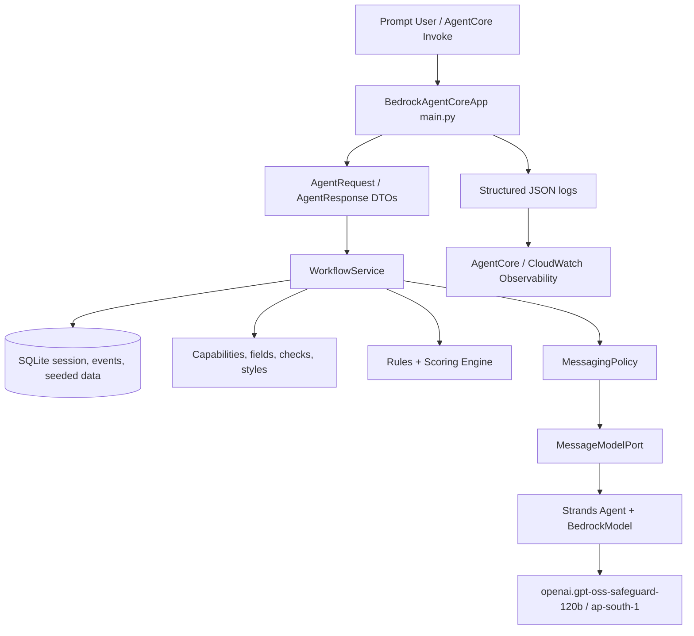

# BusinessNext Personal Loan Outreach Agent

Prompt-only Python agent for finding high-value banking customers who are likely to convert for a personal loan this month, explaining the shortlist, and drafting safe personalized outreach after human approval.

The implementation is designed as a **fully AWS-managed agent runtime**: AgentCore hosts the prompt entrypoint, Bedrock provides the model, IAM controls access, and CloudWatch/AgentCore Observability captures runtime telemetry. The response contract is also structured so a frontend can be added later without changing the core workflow.

## What The Agent Can Do

- Explain its capabilities, available data fields, checks, and message styles in plain business language.
- Select relevant customers from the provided fabricated banking dataset.
- Run eligibility checks, score customers, estimate conversion likelihood, and recommend a personal-loan outreach action.
- Ask for human approval before every sensitive step: customer selection, checks, shortlist acceptance, message style, Bedrock drafting, and final messages.
- Draft personalized but compliant outreach messages using Strands + Bedrock only after approval.
- Clearly report missing/unavailable fields and suggest closest available data categories.

## Architecture



## Architectural Decisions Worth Noting

These are the main implementation decisions, written plainly:

- **Fully AWS-managed agent path:** the runtime is designed around AgentCore, Bedrock, IAM roles, and CloudWatch rather than a self-hosted API server. That keeps deployment, scaling, security, and observability aligned with AWS managed services.
- **Strands for AWS-native agent development:** Strands makes it straightforward to define tools, connect to Bedrock models, use AWS-oriented retry behavior, and keep the agent implementation close to AgentCore deployment patterns.
- **One simple entrypoint:** AgentCore calls only `main.py`. The agent is prompt-first and does not expose many business APIs.
- **Reusable workflow logic:** `WorkflowService` contains the business flow, so the same logic can be used from AgentCore today and a frontend later.
- **Clear contracts:** Pydantic models define requests, responses, session state, approvals, evaluations, and message drafts.
- **Approvals are built in:** the user must approve important steps with a token. The agent does not move ahead on vague replies like "yes" or "continue".
- **Scoring is explainable:** every shortlisted customer has rule outcomes, score, likelihood, and recommendation rationale.
- **Bedrock is isolated:** message generation goes through `MessageModelPort`, making the model easy to replace and easy to fake in tests.
- **Retries use Strands:** live model calls use Strands `ModelRetryStrategy`; after retries fail, the app returns a safe template fallback.
- **Frontend-ready from day one:** responses include `status`, `approval_token`, `events`, and `structured_result`, so a UI can be added without rewriting the agent.
- **Observable and privacy-conscious:** logs include request IDs, trace IDs, latency, status, and errors, but not full prompts, customer records, or generated messages.
- **Storage can be replaced later:** SQLite keeps the project easy to run for review, while the repository layer is the place to switch to DynamoDB or PostgreSQL.

For a visual execution view, see [workflow.md](workflow.md).

## Source Layout

```text
src/businessnext_agent/
  application/      HITL workflow and use-case orchestration
  domain/           catalogs, scoring rules, and messaging policy
  infrastructure/   SQLite repository and structured observability
  orchestration/    Strands tool wrappers
  runtime.py        AgentCore service assembly and invoke contract
  schemas.py        Shared Pydantic DTOs
  config.py         Environment-driven settings
```

## Response Contract

AgentCore input:

```json
{
  "session_id": "optional-session-id",
  "prompt": "Find high-value customers likely to convert this month"
}
```

AgentCore output:

```json
{
  "session_id": "session-id",
  "status": "completed | needs_approval | needs_clarification | error",
  "message": "Plain-language response",
  "suggested_prompts": [],
  "approval_token": "only when approval is needed",
  "events": [],
  "structured_result": {}
}
```

`structured_result.observability` includes `request_id`, `trace_id`, and `latency_ms` for runtime correlation.

## Example Conversation

Start with:

```json
{"prompt": "help"}
```

Then:

```json
{"prompt": "Find high-value customers likely to convert this month"}
```

The agent returns a short explanation and an approval token. Continue with:

```json
{
  "session_id": "returned-session-id",
  "prompt": "approve returned-token"
}
```

To select specific scoring checks:

```json
{
  "session_id": "returned-session-id",
  "prompt": "approve returned-token INT001 CRD001 TIM001"
}
```

Hard eligibility filters always run, even when the user selects a smaller scoring set.

## Local Setup

```powershell
uv sync --extra dev
```

For deterministic local runs without Bedrock:

```powershell
$env:BUSINESSNEXT_USE_FAKE_MODEL = "true"
```

Invoke locally:

```powershell
uv run python - <<'PY'
from businessnext_agent.runtime import invoke

print(invoke({"prompt": "help"}))
PY
```

## AgentCore Deployment

Install the AgentCore CLI:

```powershell
npm install -g @aws/agentcore
```

Configure the runtime:

```powershell
.\deploy\agentcore\configure.ps1 `
  -AccountId "<account-id>" `
  -Region "ap-south-1"
```

Deploy:

```powershell
.\deploy\agentcore\deploy.ps1
```

Invoke:

```powershell
.\deploy\agentcore\invoke-help.ps1
```

The deployment pack also includes IAM examples and a one-time CloudWatch Transaction Search setup script under `deploy/agentcore`.

## Observability

The app emits structured JSON logs to stdout with:

- `request_id`, `trace_id`, and `session_id`
- operation name
- latency in milliseconds
- status and workflow event count
- error type and stack trace for failures

AgentCore Runtime can add managed OpenTelemetry traces, metrics, and CloudWatch dashboards when observability is enabled for the account/runtime.

The app does not log full prompts, generated customer messages, or raw customer records. It logs prompt length and workflow metadata to reduce PII exposure.

## Product Readiness And Quality

```powershell
uv run ruff check .
uv run ruff format --check .
uv run pytest
```

Current quality status:

- **Tests:** 21 backend tests.
- **Coverage:** 100% over `src/businessnext_agent`.
- **Linting:** Ruff check passes.
- **Formatting:** Ruff format check passes.
- **Deployment readiness:** AgentCore entrypoint, deployment scripts, IAM examples, env template, and observability setup are included.
- **Operational readiness:** structured JSON logs, request/session/trace correlation, latency, error logging, retries, safe fallback behavior, and no raw PII logging.
- **Product readiness:** strong for a hiring project / production-style PoC. For a real bank production rollout, the next steps would be live AWS validation, security review, CI/CD pipeline, production data store, and model evaluation against historical campaign outcomes.

## Trade-Offs

- Likelihood is heuristic and explainable because no historical conversion labels were provided.
- SQLite is used to keep the assignment self-contained; the repository layer is the migration point for DynamoDB/PostgreSQL.
- No live AWS smoke test is included, because this hiring project should not require reviewer AWS credentials.

## Useful Files

- `main.py`: AgentCore entrypoint.
- `src/businessnext_agent/application/workflow.py`: HITL workflow and state machine.
- `src/businessnext_agent/domain/rules.py`: scoring and likelihood logic.
- `src/businessnext_agent/domain/messaging.py`: message policy, safety redaction, Bedrock model port.
- `src/businessnext_agent/infrastructure/observability.py`: structured JSON logging.
- `deploy/agentcore`: AgentCore deployment scripts and IAM examples.
- `agent.md`: agent capabilities, HITL policy, and message safety rules.
- `workflow.md`: visual workflow, approval state machine, and runtime sequence.
