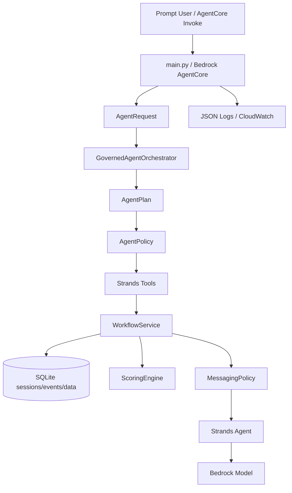

# BusinessNext Personal Loan Outreach Agent

Governed agentic AI system for identifying high-potential bank customers for a personal-loan campaign, explaining the shortlist, and drafting safe outreach only after human approval.

## Design Philosophy: Governed Autonomy

This system is **intentionally not a fully autonomous agent**. In regulated banking, unconstrained LLM planning creates unacceptable risk:

| Fully Autonomous Agent | This System (Governed Agent) |
|---|---|
| LLM decides who to contact | LLM helps discover and rank; deterministic policy decides contactability |
| LLM can skip compliance steps | Consent, DND, KYC, fraud, delinquency checks are **always deterministic** |
| Approval is optional or implicit | Every major step requires **token-bound human approval** |
| Planning errors propagate silently | `AgentPolicy` validates every plan before execution; unsafe directives are flagged |
| Output is opaque | Every decision is explainable: scored rules, matched conditions, exclusion reasons |

### Where the Agent Reasons

- **LLM-backed planning** — `BedrockPlanner` uses Bedrock to generate structured `AgentPlan` objects: classifying intent, selecting tools, extracting filters (segment, city, credit score thresholds), and producing routing rationale from natural language. The `HybridPlanner` runs this first and falls back to deterministic matching only when the model is unavailable.
- **Intent classification and filter extraction** — the LLM interprets natural-language prompts to extract segment, city, employment type, threshold constraints, and classify intent across seven governed categories. This reasoning is schema-validated and policy-checked before execution.
- **Customer selection reasoning** — the agent interprets segment, city, employment, threshold, and loan-intent signals from free-text prompts to build dynamic cohorts.
- **Prompt normalization** — synonyms like "CIBIL" → "credit score" and "top customers" → "high-value customers" are resolved before downstream processing.
- **Scenario-aware message drafting** — the agent selects outreach scenarios (abandoned application, EMI calculator usage, loan inquiry followup, pre-approved offer, near-closure, liquidity context) and drafts personalized messages through Bedrock with structured output.
- **Safety filtering** — model outputs are redacted for sensitive triggers and discarded entirely if they contain meta-response leakage.

### Where Deterministic Controls Override Model Reasoning (By Design)

- **Compliance filters** — consent, DND, KYC, fraud, complaints, delinquency, recent repayment. These are **not opinion questions**. They are governed campaign rules enforced deterministically. No model reasoning can bypass these checks.
- **Approval gates** — the state machine requires explicit token-bound approval at every stage. Loose confirmations like "yes" or "go ahead" are rejected. The policy layer enforces this regardless of how a plan was generated.
- **Scoring weights and bands** — configured in auditable JSON rules, not inferred by a model. This ensures reproducibility and regulatory defensibility.

This is the architecture pattern expected in production banking AI: **LLM reasoning where it aids discovery, deterministic controls where compliance is critical**.

## What The Agent Does

- Finds candidate customers from the fabricated bank dataset.
- Runs mandatory hard filters and explainable weighted scoring.
- Separates eligible outreach candidates from customers excluded by compliance/risk filters.
- Estimates heuristic conversion likelihood and recommends next outreach action.
- Requires token-bound human approval before evaluation, checks, shortlist acceptance, message style, Bedrock drafting, and final messages.
- Drafts personalized messages with sensitive-trigger redaction and safe fallback templates.

## Architecture



## How the Planner Works: Hybrid Model + Deterministic Fallback

The system uses a **hybrid planning architecture** composed through `HybridPlanner` with two concrete `PlannerPort` implementations:

1. **`BedrockPlanner`** — LLM-backed structured planning that generates a JSON `AgentPlan` through Bedrock:
   - **Intent classification** — maps natural-language prompts to one of seven governed intents (capability_discovery, field_catalog, check_catalog, message_style_catalog, workflow_reset, approval_continuation, campaign_workflow).
   - **Filter extraction** — infers segment, city, employment type, and threshold constraints from free text (e.g., "premium customers in Mumbai with CIBIL above 740" extracts segment=premium, city=mumbai, credit_score_min=740).
   - **Rationale generation** — produces a human-readable explanation of why the prompt was routed to a specific tool.
   - **Prompt normalization** — resolves synonyms ("CIBIL" → "credit score") before downstream processing.

2. **`DeterministicPlanner`** — keyword/intent matching for well-known routes:
   - Approval continuations with token validation.
   - Help/reset requests.
   - Catalog queries (fields, checks, message styles).
   - Provides **guaranteed fallback** when the model is unavailable or fails.

`HybridPlanner` composes these: **the model planner runs first when available, with the deterministic planner as a failsafe**.

Every plan — model-generated or deterministic — is validated by `AgentPolicy` before any tool executes:
- `AgentPlan` schema enforcement for bounded intent and tool names.
- `SENSITIVE_DIRECTIVES` detection for bypass-attempt blocking (e.g., "skip approval" flags as `blocked_directive`).
- Risk flag propagation for observability.

This is the pattern used in production agentic systems: **LLM reasoning where it helps, bounded by policy validation and deterministic fallback for reliability**.

## Why Likelihood Is Heuristic, Not ML

The `heuristic_likelihood_pct` score is a monotonic transform of the weighted rule score. This is intentional:

- **No historical conversion labels were provided.** Training a propensity model on fabricated data would produce false confidence. The heuristic is honest about what it represents: a score-to-likelihood mapping calibrated to priority bands.
- **Explainability over accuracy.** Every likelihood estimate traces back to named rules with stated conditions. An RM can see *why* a customer scored 78% — not just that they did.
- **Calibration-ready.** When historical campaign outcomes become available, the `_likelihood` function is the single replacement point. The `CustomerEvaluation` schema, the ranking logic, and the downstream messaging layer do not change.

## Data Integration Architecture

The current implementation uses SQLite with JSON-seeded customer, rule, and messaging data. This is the **correct minimal choice** for a self-contained hiring PoC:

- The `SQLiteStore` repository layer is the **only** component that touches persistence. Swapping to DynamoDB, PostgreSQL, or a CRM API requires implementing the same five methods (`list_customers`, `get_customer`, `get_rules`, `get_session`, `save_session`).
- Customer data, shortlisting rules, and messaging templates are loaded from separate seed files — the same separation that would exist with separate microservices or API calls.
- The scoring engine, messaging policy, and workflow service accept plain `dict` customer records. They have **zero coupling** to SQLite.

In a production deployment, `SQLiteStore` would be replaced by a `CRMAdapter` that calls the bank's customer API, a `RulesService` that loads campaign rules from a configuration store, and a `SessionStore` backed by DynamoDB or Redis.

## Key Design Choices

- **Governed autonomy over full autonomy:** the agent reasons through LLM planning and message drafting, but cannot bypass compliance.
- **Hybrid planning with fallback:** `BedrockPlanner` provides LLM-backed task decomposition and filter extraction; `DeterministicPlanner` guarantees reliable routing. Both are policy-validated before execution.
- **Schema-first planning:** `AgentPlan` constrains intent, tool name, prompt, extracted filters, rationale, and risk flags — whether generated by Bedrock or deterministic fallback.
- **Policy before execution:** unsafe prompts are flagged via `AgentPolicy` before tools run; hard filters always run during workflow.
- **Model isolation:** message generation goes through `MessageModelPort`, so Bedrock can be faked in tests and swapped later.
- **Frontend-ready contract:** responses expose status, approval token, events, structured results, observability, and route metadata.

For a deeper architecture framing, see [ARCHITECTURE_REVIEW.md](ARCHITECTURE_REVIEW.md). For flow diagrams, see [workflow.md](workflow.md).

## Source Layout

```text
src/businessnext_agent/
  orchestration/    Agent planner, policy, router, route evals, Strands tools
  application/      HITL workflow and state machine
  domain/           catalogs, scoring rules, messaging policy
  infrastructure/   SQLite repository and structured observability
  runtime.py        AgentCore-compatible service assembly
  schemas.py        Pydantic contracts
```

## Response Contract

Input:

```json
{
  "session_id": "optional-session-id",
  "prompt": "Find high-value customers likely to convert"
}
```

Output:

```json
{
  "session_id": "session-id",
  "status": "completed | needs_approval | needs_clarification | error",
  "message": "Plain-language response",
  "suggested_prompts": [],
  "approval_token": "only when approval is needed",
  "events": [],
  "structured_result": {
    "agentic_route": {},
    "observability": {}
  }
}
```

## Example Conversation

```json
{ "prompt": "Find high-value customers likely to convert this month" }
```

The agent returns `needs_approval` and an approval token.

```json
{ "session_id": "returned-session-id", "prompt": "approve returned-token" }
```

For check selection:

```json
{
  "session_id": "returned-session-id",
  "prompt": "approve returned-token INT001 CRD001 TIM001"
}
```

Mandatory hard filters always run, even when the user narrows optional scoring checks.

## Local Setup

PowerShell:

```powershell
uv sync --extra dev
$env:BUSINESSNEXT_USE_FAKE_MODEL = "true"
uv run pytest
```

macOS / Linux:

```bash
uv sync --extra dev
export BUSINESSNEXT_USE_FAKE_MODEL=true
uv run pytest
```

Local invoke:

```bash
uv run python -c "
from businessnext_agent.runtime import invoke
print(invoke({'prompt': 'help'}))
"
```

## Observability

The app emits structured JSON logs to stdout with:

- `request_id`, `trace_id`, and `session_id`
- operation name
- latency in milliseconds
- status and workflow event count
- error type and stack trace for failures

AgentCore Runtime can add managed OpenTelemetry traces, metrics, and CloudWatch dashboards when observability is enabled for the account/runtime.

The app does not log full prompts, generated customer messages, or raw customer records. It logs prompt length and workflow metadata to reduce PII exposure.

## Agentic Dashboard

The repository includes a Next.js dashboard under `apps/dashboard`. It provides a customer grid, guided AgentCore workflow controls, explicit approval buttons, ranked shortlist rendering, message-style selection, draft review, and a workflow event timeline.

```bash
cd apps/dashboard
npm install
cp .env.example .env.local
npm run dev
```

Set `AGENTCORE_RUNTIME_ARN`, `AWS_REGION`, and `DASHBOARD_PASSWORD` in `.env.local`. The browser talks only to Next.js route handlers; the server-side adapter invokes AgentCore with AWS SDK credentials from the local environment or deployment role.

For a minimal-cost hosted demo, deploy the dashboard on Vercel Hobby with project root `apps/dashboard`. See `apps/dashboard/README.md` for the Vercel settings and required environment variables.

## Deployment

```bash
# Configure (PowerShell)
.\deploy\agentcore\configure.ps1 -AccountId "<account-id>" -Region "ap-south-1"

# Deploy
.\deploy\agentcore\deploy.ps1

# Invoke
.\deploy\agentcore\invoke-help.ps1
```

The deployment pack includes IAM examples and a one-time CloudWatch Transaction Search setup script under `deploy/agentcore`.

## Quality

```bash
uv run ruff check .
uv run ruff format --check .
uv run pytest
```

- **Tests:** 33 across orchestrator routing, workflow integration, scoring, messaging, observability, and runtime.
- **Coverage:** 100% over `src/businessnext_agent`.
- **Linting:** Ruff check passes.
- **Formatting:** Ruff format check passes.
- **Deployment readiness:** AgentCore entrypoint, deployment scripts, IAM examples, env template, and observability setup.
- **Operational readiness:** structured JSON logs, request/session/trace correlation, latency, error logging, retries, safe fallback behavior, and no raw PII logging.

## Trade-Offs

- **Governed autonomy over full autonomy.** The agent reasons through LLM planning and message drafting, but compliance-critical controls (consent, DND, KYC, fraud, delinquency) are deterministic by design and cannot be bypassed. A personal-loan campaign agent that skips these checks is not better — it is a liability.
- **Hybrid planning over a single approach.** `BedrockPlanner` provides LLM-backed intent classification and filter extraction for ambiguous prompts; `DeterministicPlanner` provides zero-latency fallback for well-known routes. Both are policy-validated. This is not a choice to avoid model reasoning — it is a choice to make it reliable and auditable.
- **Heuristic likelihood over false-precision ML.** No historical conversion labels were provided. The heuristic is explainable and calibration-ready; training on fabricated data would produce false confidence.
- **SQLite over production persistence.** The repository layer has zero coupling to SQLite. Swapping to DynamoDB or PostgreSQL requires implementing the same five methods — no domain or orchestration code changes.
- **WorkflowService as a single narrative.** The approval state machine, customer selection, scoring orchestration, and messaging dispatch are consolidated in one class (~700 lines) to keep the workflow readable as a linear hiring-PoC narrative. In production, these would be extracted into separate bounded-context services behind the same `AgentRequest → AgentResponse` contract.
- **No live AWS smoke test.** This hiring project should not require reviewer AWS credentials. The Bedrock integration is behind `MessageModelPort` and fully testable with `FakeMessageModel`.

## Useful Files

- `main.py`: AgentCore entrypoint.
- `src/businessnext_agent/application/workflow.py`: HITL workflow and state machine.
- `src/businessnext_agent/domain/rules.py`: scoring and likelihood logic.
- `src/businessnext_agent/domain/messaging.py`: message policy, safety redaction, Bedrock model port.
- `src/businessnext_agent/infrastructure/observability.py`: structured JSON logging.
- `src/businessnext_agent/orchestration/router.py`: governed agent orchestrator and policy-validated routing.
- `src/businessnext_agent/orchestration/evals.py`: route eval harness with bypass-attempt testing.
- `deploy/agentcore`: AgentCore deployment scripts and IAM examples.
- `agent.md`: agent capabilities, HITL policy, and message safety rules.
- `workflow.md`: visual workflow, approval state machine, and runtime sequence.
