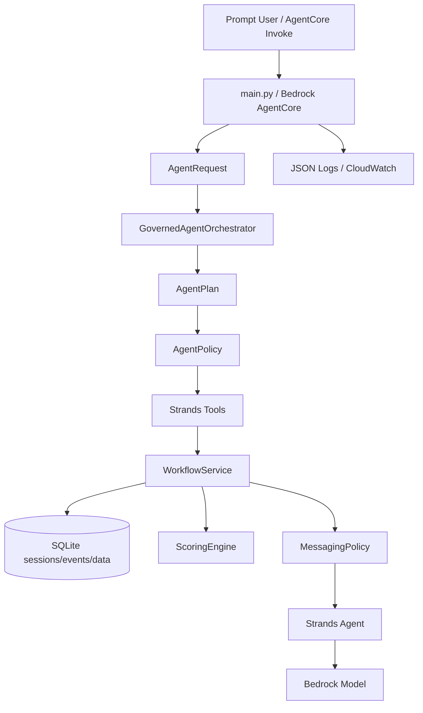

# BusinessNext Personal Loan Outreach Agent

Governed agentic AI app for identifying high-potential bank customers for a personal-loan campaign, explaining the shortlist, and drafting safe outreach only after human approval.

This project is intentionally **not a free-form autonomous agent**. It is a regulated banking design: the agent plans, routes, explains, drafts, and records decisions, while compliance-critical controls such as consent, DND, hard filters, approval tokens, and final outreach remain deterministic.

## Why This Is Agentic

- `GovernedAgentOrchestrator` turns each prompt into a bounded `AgentPlan`.
- `AgentPolicy` validates the plan, corrects tool/intent mismatches, and flags unsafe directives such as approval bypass attempts.
- Strands-decorated tools expose capabilities, field discovery, check discovery, message styles, and workflow execution.
- Route decisions are returned in `structured_result.agentic_route` and written to workflow events when a session exists.
- Route evals test tool selection, approval continuation, prompt normalization, campaign routing, and bypass attempts.
- Bedrock/Strands drafting uses structured output, retry strategy, system prompt, stable agent identity, trace attributes, state metadata, and sliding-window conversation management.

## What The Agent Does

- Finds candidate customers from the fabricated bank dataset.
- Runs mandatory hard filters and explainable weighted scoring.
- Separates eligible outreach candidates from customers excluded by compliance/risk filters.
- Estimates heuristic conversion likelihood and recommends next outreach action.
- Requires token-bound human approval before evaluation, checks, shortlist acceptance, message style, Bedrock drafting, and final messages.
- Drafts personalized messages with sensitive-trigger redaction and safe fallback templates.

## Architecture



## Key Design Choices

- **Governed autonomy over full autonomy:** the agent can plan and route, but cannot bypass compliance.
- **Schema-first planning:** `AgentPlan` constrains intent, tool name, prompt, extracted filters, rationale, and risk flags.
- **Policy before execution:** unsafe prompts are flagged before tools run; hard filters always run later in the workflow.
- **Deterministic core workflow:** this is deliberate for banking auditability.
- **Hybrid-ready planning:** a model-backed planner can be plugged into `HybridPlanner`; deterministic planning remains the fallback.
- **Model isolation:** message generation goes through `MessageModelPort`, so Bedrock can be faked in tests and swapped later.
- **Frontend-ready contract:** responses expose status, approval token, events, structured results, observability, and route metadata.

For a deeper hiring-review framing, see [ARCHITECTURE_REVIEW.md](ARCHITECTURE_REVIEW.md). For flow diagrams, see [workflow.md](workflow.md).

## Source Layout

```text
src/businessnext_agent/
  orchestration/    Agent planner, policy, router, route evals, Strands tools
  application/      HITL workflow and state machine
  domain/           catalogs, scoring rules, messaging policy
  infrastructure/   SQLite repository and structured observability
  runtime.py        AgentCore-compatible service assembly
  schemas.py        Pydantic contracts
```

## Response Contract

Input:

```json
{"session_id": "optional-session-id", "prompt": "Find high-value customers likely to convert"}
```

Output:

```json
{
  "session_id": "session-id",
  "status": "completed | needs_approval | needs_clarification | error",
  "message": "Plain-language response",
  "suggested_prompts": [],
  "approval_token": "only when approval is needed",
  "events": [],
  "structured_result": {
    "agentic_route": {},
    "observability": {}
  }
}
```

## Example Conversation

```json
{"prompt": "Find high-value customers likely to convert this month"}
```

The agent returns `needs_approval` and an approval token.

```json
{"session_id": "returned-session-id", "prompt": "approve returned-token"}
```

For check selection:

```json
{"session_id": "returned-session-id", "prompt": "approve returned-token INT001 CRD001 TIM001"}
```

Mandatory hard filters always run, even when the user narrows optional scoring checks.

## Local Setup

```powershell
uv sync --extra dev
$env:BUSINESSNEXT_USE_FAKE_MODEL = "true"
uv run pytest
```

Local invoke:

```powershell
uv run python - <<'PY'
from businessnext_agent.runtime import invoke
print(invoke({"prompt": "help"}))
PY
```

## Quality Status

- Tests: 31
- Coverage: 100% over `src/businessnext_agent`
- Lint: `uv run ruff check .`
- Format: `uv run ruff format --check .`
- Runtime: AgentCore-compatible `main.py`
- Deployment assets: `deploy/agentcore`, IAM examples, AgentCore config, CloudWatch setup

## Production Gaps

- Live AWS smoke test with real AgentCore/Bedrock credentials.
- Model-backed planner implementation behind `HybridPlanner`.
- Larger offline eval dataset with regression thresholds.
- Historical conversion labels for propensity calibration.
- Production data store such as DynamoDB or PostgreSQL.
- Security review, CI/CD, and bank compliance sign-off.

These are left explicit because the current project is a self-contained hiring PoC, not a bank production deployment.
