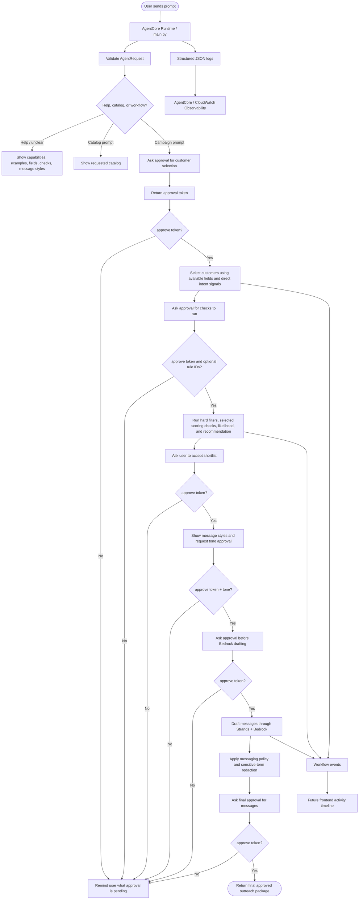
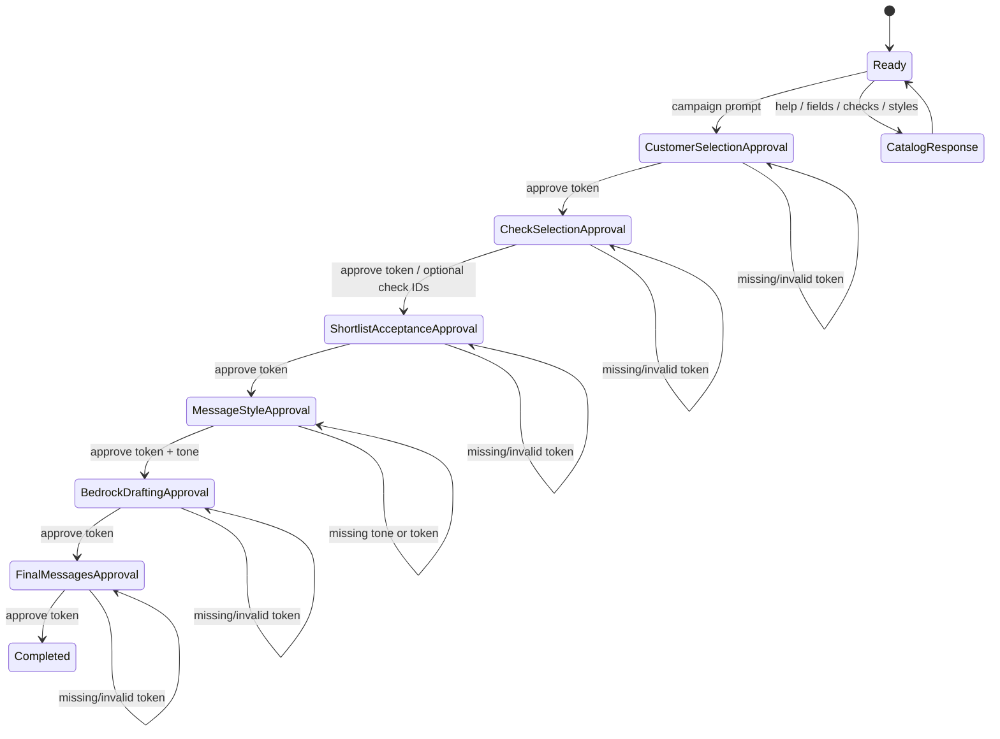
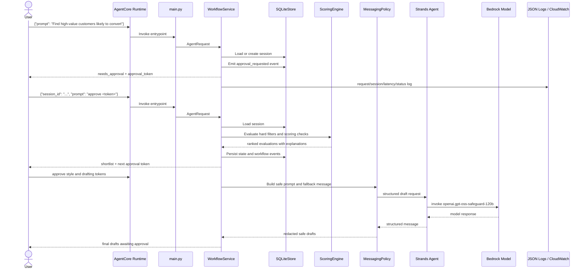

# Agent Workflow

This document shows how the prompt-only AgentCore agent moves from a business request to an approved customer shortlist and safe outreach drafts.

## End-To-End Flow

## Approval State Machine

## Runtime Sequence

## What A Future Frontend Can Reuse

- `status` to decide whether to show a normal answer, clarification prompt, or approval action.
- `approval_token` to render explicit approve buttons.
- `events` to render an activity timeline.
- `structured_result` to render tables for shortlisted customers, checks, likelihood, and draft messages.
- `structured_result.observability` to correlate a user-visible session with CloudWatch logs and AgentCore traces.
